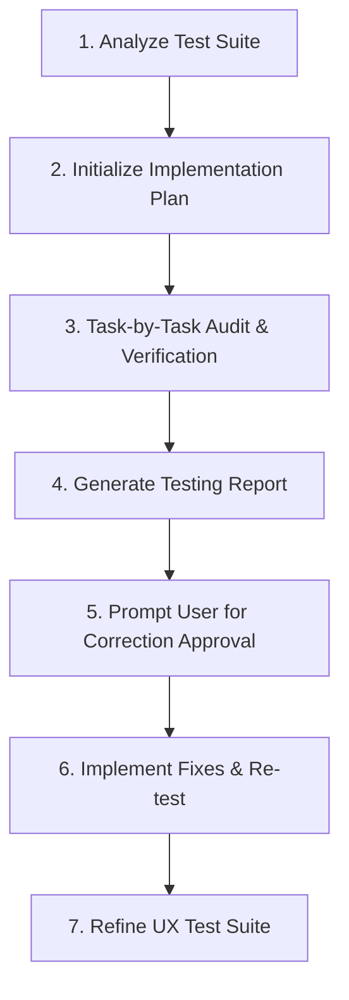

# CRM Testing Workflow (/test-crm)

This workflow defines the systematic, sequential execution process for testing and verifying all user-actions in the CRM platform. It ensures the agent follows a strict verification pipeline.

## Workflow Execution Steps

### 1. Analyze Test Suite
*   **Action**: Read [ux_test.md](file:///home/vincenzo/Code/gestoray/ux_test.md) to parse all defined micro-actions.
*   **Focus**: Identify role boundaries, database writes (under `original` and `edits` namespaces), and trigger behaviors.

### 2. Initialize Implementation Plan
*   **Action**: Open the `implementation_plan.md` and `task.md` artifacts in Planning Mode.
*   **Standard**: Create a separate checklist task item for every single micro-action in the test suite. Do not group multiple actions under a single checkbox.

### 3. Task-by-Task Audit & Verification
*   **Action**: Verify each task item individually:
    *   Inspect client Svelte pages and sub-components.
    *   Verify Firestore rules constraint checks (`firestore.rules`).
    *   Verify Cloud Function triggers (`functions/src/triggers/*`).
    *   Confirm correct state transition (e.g. status resetting from `approved` to `pending` upon storno, client deletion blocks, contract deletion blocks).

### 4. Generate Testing Report
*   **Action**: Compile and output the results in [ux_testing_report.md](file:///home/vincenzo/Code/gestoray/ux_testing_report.md).
*   **Standard**: Mark each action as `[PASSED]` or `[FAILED]` with concrete files and line ranges.

### 5. Prompt User for Correction Approval
*   **Action**: Present the report summary and explicitly ask:
    > "Vuoi procedere all'applicazione delle correzioni descritte nel report per risolvere le azioni contrassegnate come FAILED?"
*   **Rule**: Stop and wait for the user's approval before modifying any code.

### 6. Implement Fixes & Re-test
*   **Action**: Apply the approved corrections, verify them, and update the report status to `[PASSED]`.

### 7. Refine UX Test Suite
*   **Action**: Re-read [ux_test.md](file:///home/vincenzo/Code/gestoray/ux_test.md) to see if new test scenarios (such as edge-cases or denormalization syncs) are needed, adding them to the test suite for future runs.
