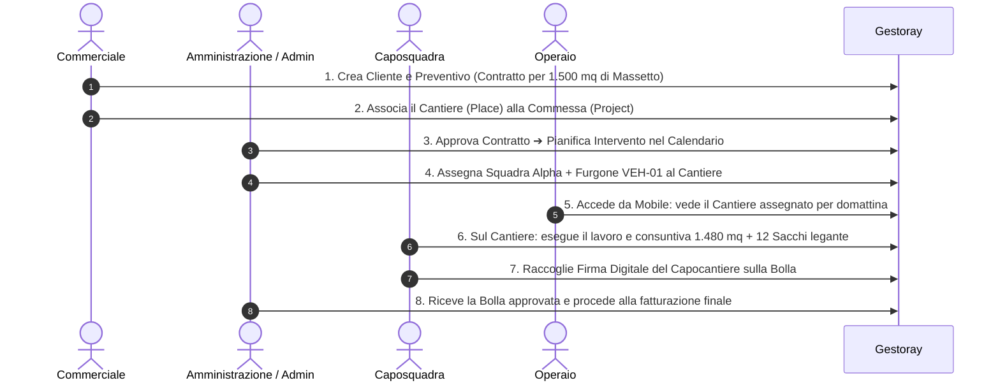
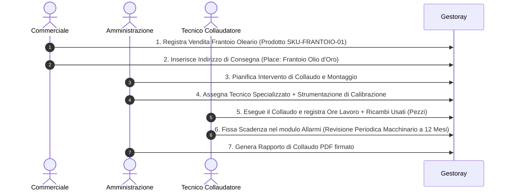

# 📋 Gestoray ERP — Documento Use Cases & Persona Workflows

> **Obiettivo**: Questo documento descrive l'adattabilità dell'architettura agnostica di **Gestoray ERP** rispetto a due modelli di business radicalmente differenti. Dimostra come, senza modificare una singola riga di codice sorgente ma attraverso la pura configurazione dei moduli, il sistema risponda perfettamente alle esigenze operative delle PMI.

---

## 👤 User Personas & Ruoli di Sistema

In Gestoray ERP, i ruoli utente (RBAC) sono standardizzati per garantire la sicurezza del dato e la separazione dei compiti:

| Ruolo | Descrizione Operativa |
|:---|:---|
| **Superadmin / Direzione** | Accesso completo a tutti i moduli, impostazioni di sistema, configurazione dinamica del menu e gestione utenti. |
| **Amministrazione** | Gestione finanziaria, consuntivi, fatturazione, contratti, scadenze e pianificazione globale. |
| **Commerciale / Agente** | Gestione anagrafica clienti, opportunità, contratti/preventivi e tracciamento delle proprie attività. |
| **Tecnico / Caposquadra** | Gestione operativa degli interventi, coordinamento membri del team, compilazione delle bolle/consuntivi sul campo. |
| **Operaio / Operatore** | Visualizzazione delle proprie assegnazioni giornaliere (luoghi, mezzi, orari) e consuntivazione delle ore/materiali. |

---

## 🏢 Scenario 1: Azienda Tipo A — Servizi Edili & Sottofondi (es. "Massetti")

### ⚙️ Configurazione Agnostica dei Moduli
- **Modulo `places`**: `entityNaming` = `cantiere` (Singolare: *Cantiere*, Plurale: *Cantieri*)
- **Modulo `teams`**: `entityNaming` = `squadra` (Singolare: *Squadra*, Plurale: *Squadre*)
- **Modulo `vehicles`**: `entityNaming` = `furgone` (Singolare: *Furgone*, Plurale: *Parco Furgoni*)
- **Modulo `projects`**: `entityNaming` = `commessa` (Singolare: *Commessa*, Plurale: *Commesse*)
- **Modulo `interventi`**: `entityNaming` = `bolla` | `mode` = `ad_erogazione` | UdM predefinita = `mq` / `mc`

---

### 🔄 Flusso di Lavoro Inter-Ruolo (Azienda Tipo A)

#### 1. Commerciale (Agente)
- **Azioni nel Sistema**:
  - Crea l'anagrafica del Cliente (es. *Impresa Edile Rossi Srl*).
  - Aggiunge il **Cantiere** di destinazione (es. *Cantiere Via Roma 45, Milano*).
  - Emette un **Preventivo/Contratto** per la realizzazione di 1.500 mq di sottofondo allegando il listino prezzi al mq.

#### 2. Amministrazione / Admin
- **Azioni nel Sistema**:
  - Valida ed approva il Contratto commerciale.
  - Apre la scheda **Pianificazione (Scheduling)** e programma l'intervento per il giorno prefissato (Slot: *Giornata Intera*).
  - Utilizza il componente **Assegnazione Multipla** per associare all'intervento:
    - **Squadra**: *Squadra Alpha* (Caposquadra: Mario Rossi).
    - **Mezzo**: *Furgone Silo VEH-2026-003*.
    - **Cantiere**: *Cantiere Via Roma 45*.

#### 3. Caposquadra & Operaio
- **Azioni nel Sistema**:
  - L'operaio accede al gestionale e vede la propria **Vista Filtrata Personale**: *Dove andare, con chi lavorare e quale furgone guidare*.
  - A fine giornata, il Caposquadra apre la scheda **Consuntivazione / Bolla**:
    - Registra i `mq` effettivi realizzati (es. *1.480 mq*).
    - Inserisce i materiali di consumo impiegati (`Sacchi Additivo`, `Cisterna Acqua`).
    - Fa firmare digitalmente il capocantiere del cliente sul tablet/smartphone.
    - La Bolla passa allo stato **Completato & Approvato**.

---

## 🏭 Scenario 2: Azienda Tipo B — Vendita & Installazione Macchinari Agricoli (es. "Molitura Olive")

### ⚙️ Configurazione Agnostica dei Moduli
- **Modulo `places`**: `entityNaming` = `destinazione` (Singolare: *Sede di Consegna*, Plurale: *Sedi Operative*)
- **Modulo `teams`**: `entityNaming` = `risorsa` (Singolare: *Gruppo Tecnico*, Plurale: *Gruppi Tecnici*)
- **Modulo `vehicles`**: `entityNaming` = `macchinario` (Singolare: *Strumento di Collaudo*, Plurale: *Attrezzatura*)
- **Modulo `projects`**: `entityNaming` = `pratica` (Singolare: *Pratica di Installazione*, Plurale: *Pratiche*)
- **Modulo `interventi`**: `entityNaming` = `rapporto` | `mode` = `a_bolla` | UdM predefinita = `pz` / `ora`

---

### 🔄 Flusso di Lavoro Inter-Ruolo (Azienda Tipo B)

#### 1. Commerciale (Agente)
- **Azioni nel Sistema**:
  - Registra l'anagrafica del Frantoio cliente.
  - Compila il **Contratto di Vendita** per un *Impianto di Molitura 500kg/h* (Prodotto dal catalogo con SKU).
  - Inserisce la **Sede Operativa di Consegna** del frantoio.

#### 2. Amministrazione
- **Azioni nel Sistema**:
  - Riceve il contratto firmato ed emette il piano di consegna.
  - Pianifica l'intervento di **Installazione e Collaudo** nel modulo **Scheduling**.
  - Assegna il **Tecnico Collaudatore** ed il **Vehicle/Equipment** (es. *Kit Calibrazione Pressione TEL-09*).

#### 3. Tecnico Collaudatore
- **Azioni nel Sistema**:
  - Consulta l'agenda e si reca presso il frantoio cliente.
  - Compila il **Rapporto di Intervento / Consuntivo**:
    - Registra le `Ore` di manodopera specializzata per l'assemblaggio.
    - Inserisce i prodotti ricambio consumati (`pz` raccordi inox, `l` olio idraulico).
  - Imposta nel modulo **Scadenzario & Allarmi** una scadenza automatica a 12 mesi per la *Manutenzione Ordinaria del Frantoio*.
  - Ottiene la firma digitale del responsabile stabilimento e chiude la pratica.

---

## 📌 Mappatura Matrice Ruoli ➔ Azioni di Sistema

| Modulo / Azione | Superadmin / Direzione | Amministrazione | Commerciale | Caposquadra / Tecnico | Operaio |
|:---|:---:|:---:|:---:|:---:|:---:|
| **Configurazione Moduli & Naming** | 🟢 Full | 🔴 No | 🔴 No | 🔴 No | 🔴 No |
| **Gestione Anagrafica Clienti** | 🟢 Full | 🟢 Full | 🟢 Full (I propri) | 🔵 Lettura | 🔴 No |
| **Creazione Contratti & Preventivi** | 🟢 Full | 🟢 Full | 🟢 Full | 🔴 No | 🔴 No |
| **Pianificazione Globale (Scheduling)** | 🟢 Full | 🟢 Full | 🔵 Lettura | 🔴 No | 🔴 No |
| **VisualizzazioneProprio Agenda/Calendar** | 🟢 Full | 🟢 Full | 🟢 Full | 🟢 Full | 🟢 Solo proprie |
| **Assegnazione Persone/Squadre/Mezzi** | 🟢 Full | 🟢 Full | 🔴 No | 🔵 Solo squadra | 🔴 No |
| **Consuntivazione & Firma Bolle** | 🟢 Full | 🟢 Full | 🔵 Lettura | 🟢 Full | 🟡 Compilazione ore/mq |
| **Gestione Scadenzario & Allarmi** | 🟢 Full | 🟢 Full | 🔵 Visualizza scadenze contratti | 🔵 Visualizza scadenze mezzi | 🔵 Visualizza proprie visite |

---

> **Conclusione**: Grazie al namespacing `original/derived/edits`, all'architettura a plugin bridges ed a `UnitsOfMeasureService`, Gestoray ERP opera come una piattaforma enterprise 100% universale, perfettamente calibrata su qualsiasi modello di business senza richiedere fork di codice o customizzazioni rigide.
